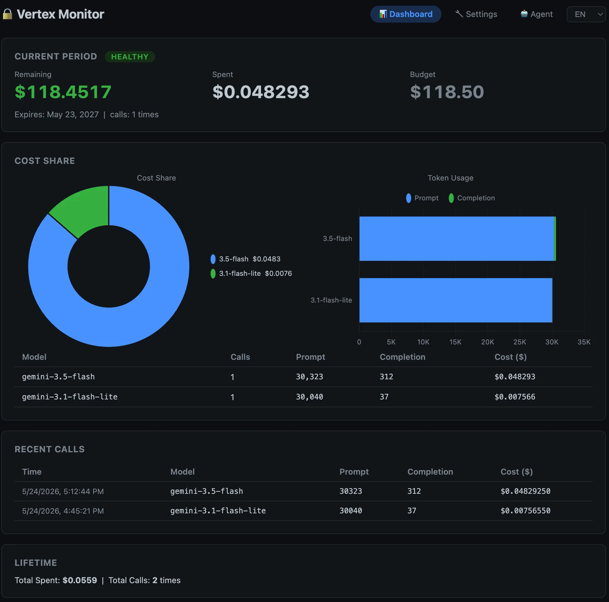
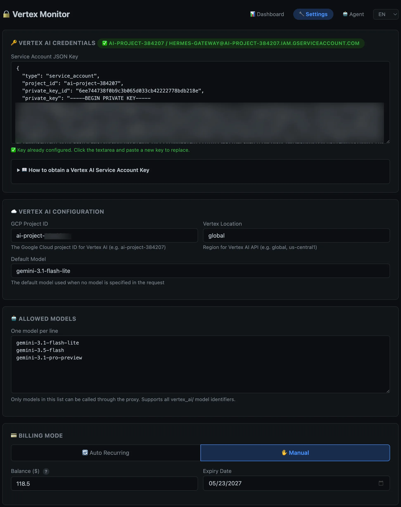
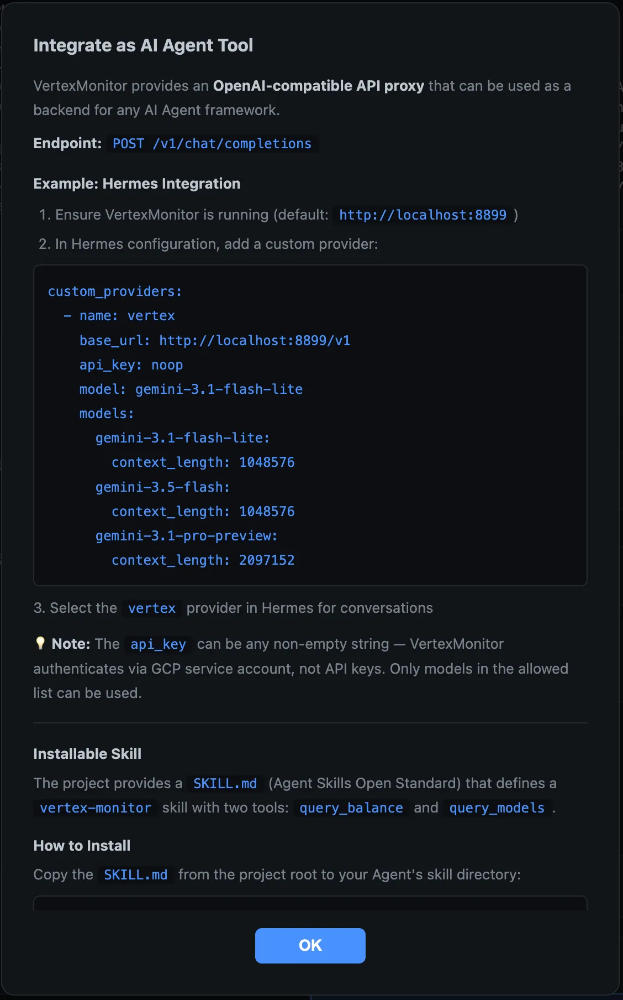

# Vertex Monitor

[中文文档](README.zh-CN.md) | English

A lightweight **budget proxy** for Google Vertex AI models (Gemini, Claude, and more) — track spending in real time, enforce hard limits, and manage everything from a clean Web UI.

> 🎯 Built for Google AI Pro subscribers who get monthly Vertex AI credits and need to **make sure they never go over budget**.

---

## Why Vertex Monitor?

**The problem**: Vertex AI charges per token, and there's no built-in way to say *"stop when I've spent $10 this month."* One runaway agent loop can burn through your entire budget.

**The solution**: Vertex Monitor sits between your apps and Vertex AI, counting every token and dollar. When the budget is gone, requests get a `402 Payment Required` — no surprises on your GCP bill.

---

## Features

| Feature | Description |
|---------|-------------|
| 🪙 **Real-time Billing** | Costs calculated per-call using official Vertex AI pricing (via liteLLM), accurate to $0.00001 |
| ✋ **Manual Mode** | Set a balance and expiry date, adjust anytime |
| 🔄 **Auto Recurring** | Monthly reset day + amount — perfect for subscription credits |
| 📊 **Web Dashboard** | Balance overview, cost breakdown charts, model stats, call history |
| ⚙️ **Settings Page** | Manage credentials, Vertex config, model allowlist, billing mode — all from the browser |
| 🤖 **Agent Integration** | Built-in Skill API + Agent help modal, AI assistants can query balance and models directly |
| 🌐 **i18n** | English + 简体中文, persisted in localStorage, zero flicker |
| 🛑 **Hard Limit** | Budget exhausted → instant `402`, no overflow |
| 🔌 **OpenAI Compatible** | Supports both SSE streaming and non-streaming, drop-in endpoint for Hermes, Cursor, or any OpenAI-compatible client |
| 🐳 **Docker** | One-command deploy, non-root user, built-in health check, data volume for persistence |

---

## Quick Start

### Option 1: Docker (Recommended)

```bash
# Clone the repo
git clone https://github.com/colin-chang/VertexMonitor.git
cd VertexMonitor

# Copy example config and edit with your GCP project ID
cp config.example.json config.json

# Place your service account key
cp ~/Downloads/your-key.json vertex-key.json

# Start
docker compose up -d
```

Open <http://localhost:8897> — you're up and running.

### Option 2: Conda

```bash
conda create -n vertex-monitor python=3.11 -y
conda activate vertex-monitor
pip install -r requirements.txt

cp config.example.json config.json
# Edit config.json with your GCP project ID
# Place vertex-key.json in project root

python proxy.py
```

---

## Web UI

The top-right navigation menu provides access to three pages:

### 📊 Dashboard



The main view shows everything at a glance:

- **Balance overview**: remaining, spent, budget, expiry, status badge (🟢 healthy / 🟡 warning / 🔴 exhausted)
- **Cost chart**: donut chart showing spending by model
- **Token chart**: stacked bar chart of prompt vs. completion tokens
- **Model stats table**: calls, tokens, and cost per model
- **Recent calls**: the last 20 API requests with full details
- **Lifetime stats**: total spending and calls across all time

### 🔧 Settings



Manage your proxy configuration without touching files:

- **Vertex AI Credentials**: paste your service account JSON key, status indicator shows if configured
- **Vertex AI Configuration**: GCP project ID, Vertex location, default model
- **Allowed Models**: one model per line — only these can be called through the proxy
- **Billing Mode**: switch between Auto Recurring (monthly reset) and Manual (custom balance + expiry)
- **Test Connectivity**: save and send a minimal request to verify everything works
- **Reset Period**: immediately clear current period spending

### 🤖 Agent Help



Click the **Agent** button in the navigation bar to open a help modal containing:

- Proxy endpoint info and integration guide
- Hermes configuration example
- Skill API install paths (Claude / Hermes / generic)
- Skill usage examples (query balance, list models, etc.)

---

## Getting a GCP Service Account Key

Vertex Monitor needs a GCP service account JSON key to call the Vertex AI API.

1. Open [GCP Console → Service Accounts](https://console.cloud.google.com/iam-admin/serviceaccounts)
2. Select your project
3. Click **Create Service Account**
   - Role: **Vertex AI User** (`roles/aiplatform.user`)
4. Go to the account → **Keys** tab → **Add Key** → **Create New Key**
5. Choose **JSON** → download the file
6. Rename it to `vertex-key.json` and place it in the project root

> ⚠️ `vertex-key.json` is excluded by `.gitignore` and will never be committed. You can also paste the key content directly via the Settings page.

---

## API Reference

### Proxy Endpoint

| Method | Path | Description |
|--------|------|-------------|
| `POST` | `/v1/chat/completions` | OpenAI-compatible chat completions (proxied to Vertex AI, supports SSE streaming) |

### Management Endpoints

| Method | Path | Description |
|--------|------|-------------|
| `GET` | `/` | Dashboard page |
| `GET` | `/settings` | Settings page |
| `GET` | `/health` | Health check + model list |
| `GET` | `/usage` | Budget status summary |
| `GET` | `/api/config` | Billing configuration + full state |
| `POST` | `/api/config` | Update billing configuration |
| `POST` | `/api/reset` | Reset current period spending |
| `GET` | `/api/stats` | Per-model cost statistics |
| `GET` | `/api/history` | Recent API call history |
| `GET` | `/api/settings` | Get credentials + Vertex config + model allowlist |
| `POST` | `/api/settings` | Save credentials + Vertex config + model allowlist |
| `POST` | `/api/test` | Test Vertex AI connectivity |

### Skill Endpoints (for AI Agents)

| Method | Path | Description |
|--------|------|-------------|
| `GET` | `/skill/balance` | Query current balance and budget status, returns a human-readable summary message |
| `GET` | `/skill/models` | Query currently allowed model list and default model |

### Update Billing Configuration

```bash
# Auto recurring: reset $10 on the 1st of each month
curl -X POST http://localhost:8897/api/config \
  -H "Content-Type: application/json" \
  -d '{"mode":"auto_recurring","auto_reset_day":1,"auto_monthly_amount":10.0}'

# Manual mode: $8.50 balance, expires end of next month
curl -X POST http://localhost:8897/api/config \
  -H "Content-Type: application/json" \
  -d '{"mode":"manual","manual_balance":8.50,"manual_expires_at":"2026-07-31"}'
```

---

## Integration

### Hermes Agent

Add to `~/.hermes/config.yaml`:

```yaml
custom_providers:
  - name: vertex-budget
    base_url: http://localhost:8897/v1
    api_key: noop
    model: gemini-3.1-flash-lite
    models:
      gemini-3.5-flash:
        context_length: 1048576
      gemini-3.1-flash-lite:
        context_length: 1048576
      gemini-3.1-pro-preview:
        context_length: 1048576
      gemini-2.5-pro:
        context_length: 2097152
      gemini-2.5-flash:
        context_length: 1048576
      gemini-2.5-flash-lite:
        context_length: 1048576
      gemini-2.0-flash:
        context_length: 1048576
      gemini-2.0-flash-lite:
        context_length: 1048576
      gemini-1.5-pro:
        context_length: 2097152
      gemini-1.5-flash:
        context_length: 1048576
```

Select `vertex-budget` with `/model` and you're set.

### Any OpenAI-Compatible Client

Point your client's `base_url` to `http://localhost:8897/v1` with any non-empty API key.

Supports both `stream: true` (SSE) and `stream: false` (JSON) modes.

---

## Supported Models

Vertex Monitor supports all models available on the Vertex AI platform, including Gemini, Claude, and other third-party models. Simply add the model identifier to the **Allowed Models** list in Settings.

### Gemini

| Model | Context Length | Status |
|-------|---------------|--------|
| `gemini-3.5-flash` | 1,048,576 | Recommended |
| `gemini-3.1-flash-lite` | 1,048,576 | Recommended |
| `gemini-3.1-pro-preview` | 1,048,576 | Preview |
| `gemini-3.1-pro-preview-customtools` | 1,048,576 | Preview |
| `gemini-3-flash` | 1,048,576 | Preview |
| `gemini-2.5-pro` | 2,097,152 | Stable |
| `gemini-2.5-flash` | 1,048,576 | Stable |
| `gemini-2.5-flash-lite` | 1,048,576 | Stable |
| `gemini-2.5-flash-live-api` | 1,048,576 | Stable |
| `gemini-2.0-flash` | 1,048,576 | Legacy |
| `gemini-2.0-flash-lite` | 1,048,576 | Legacy |
| `gemini-1.5-pro` | 2,097,152 | Legacy |
| `gemini-1.5-flash` | 1,048,576 | Legacy |

### Claude (via Vertex AI)

| Model | Context Length | Status |
|-------|---------------|--------|
| `claude-sonnet-4@20250514` | 200,000 | Recommended |
| `claude-3-5-sonnet-v2@20241022` | 200,000 | Stable |
| `claude-3-5-haiku@20241022` | 200,000 | Stable |
| `claude-3-opus@20240229` | 200,000 | Legacy |
| `claude-3-sonnet@20240229` | 200,000 | Legacy |
| `claude-3-haiku@20240307` | 200,000 | Legacy |

> 💡 The above are commonly used models. Vertex AI also offers models from Meta, Mistral, etc. — any model identifier supported by [liteLLM's `vertex_ai/` prefix](https://docs.litellm.ai/docs/providers/vertex) can be used.

---

## Docker Commands

```bash
docker compose up -d        # Start
docker compose logs -f      # View logs
docker compose down         # Stop
```

Data persists in `./data/` (mounted as a Docker volume). Port 8897.

Docker image features:

- Runs as non-root user (`appuser`)
- Built-in health check (`/health`)
- Production server via `uvicorn`

---

## Project Structure

```
VertexMonitor/
├── proxy.py                  # FastAPI proxy + API endpoints + Skill API
├── store.py                  # Billing engine (dual-mode) + statistics
├── static/
│   ├── index.html            # Dashboard page
│   ├── settings.html         # Settings page
│   ├── common.css            # Shared styles (dark theme, cards, buttons, modals)
│   ├── common.js             # Shared logic (HTML escaping, notify/help modals, agent help)
│   └── i18n.js               # Translation engine (EN / zh-CN)
├── config.example.json       # Example configuration (copy to config.json)
├── requirements.txt          # Python dependencies
├── Dockerfile
├── docker-compose.yml
├── .gitignore
├── .dockerignore
├── LICENSE                   # MIT
├── SECURITY.md
├── PRIVACY.md
├── data/                     # Runtime data (git-ignored)
│   └── .gitkeep
├── docs/
│   └── screenshots/          # UI screenshots (dashboard, settings, agent help)
└── README.md
```

---

## Security & Privacy

- **Credentials** are stored only inside the Docker container (`/app/data/`), never in Git
- **No telemetry** — your data stays on your machine
- **No external services** — the only outbound traffic is your own API calls to Google Vertex AI
- See [SECURITY.md](SECURITY.md) and [PRIVACY.md](PRIVACY.md) for details

---

## License

[MIT](LICENSE) © 2025 Colin Chang
